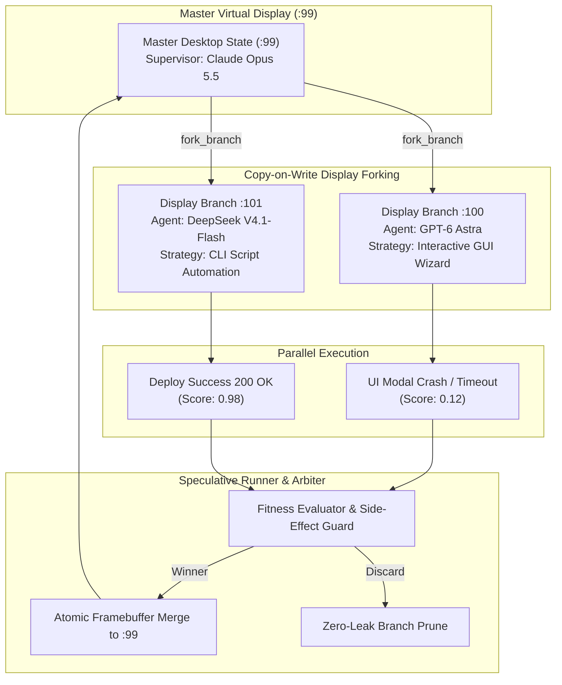

# ❖ Speculative-GUI-Fork

> **Copy-on-Write Time-Travel Display Forking Engine for Computer-Use AI Agents**  
> Enables parallel speculative path execution across isolated virtual displays with atomic winner merge and zero-leak rollback. Designed for high-stakes autonomous workflows across **Claude Opus 5.5**, **GPT-6 Astra**, and **DeepSeek V4.1-Flash**.

[](LICENSE)
[](https://python.org)
[]()
[]()

---

## ⚡ The Problem: The Single-Branch UI Dead-End

In complex computer-use tasks (cloud infrastructure provisioning, software migrations, ERP configuration), agents frequently encounter ambiguous decision forks:
* *Path A*: Click through an interactive multi-step web wizard in Chromium.
* *Path B*: Execute an automated CLI provisioning script in the terminal.

Traditional Computer-Use agents run **sequentially on a single virtual display**. If Path A fails or hangs at step 4, the virtual display and host filesystem are left in a dirty, broken half-state. Rolling back is slow or impossible, causing task failure.

**Speculative-GUI-Fork** solves this by treating virtual displays like Git branches. The orchestrator forks display `:99` into `:100` and `:101` in milliseconds using **Copy-on-Write (CoW)** memory buffers. Multiple agents race in parallel. The winning branch is atomically merged into `:99`, while failed or corrupted branches are pruned with **zero side-effects**.

---

## 📐 System Architecture



---

## 🚀 Quickstart

### 1. Installation
```bash
cd projects/speculative_gui_fork
pip install -e .
```

### 2. Run the Simulation
```bash
python3 -m speculative_gui_fork.cli simulate
```

Output:
```text
======================================================================
❖ SPECULATIVE-GUI-FORK: PARALLEL DISPLAY BRANCHING SIMULATION
======================================================================
Master Display: :99 [Claude Opus 5.5]
----------------------------------------------------------------------
[STEP 1] FORKING VIRTUAL DISPLAY :99 INTO COMPETING BRANCHES...
 • Forked Branch A -> Display :100 (Assigned: GPT-6 Astra, Role: GUI Wizard)
 • Forked Branch B -> Display :101 (Assigned: DeepSeek V4.1-Flash, Role: CLI Automation)
----------------------------------------------------------------------
[STEP 2] PARALLEL SPECULATIVE MUTATION...
 • [Branch A (:100)] Executed GUI Wizard -> Status: CRASH / TIMEOUT
 • [Branch B (:101)] Executed CLI Script  -> Status: SUCCESS (200 OK)
----------------------------------------------------------------------
[STEP 3] FITNESS EVALUATION & ATOMIC WINNER MERGE...
 • Winning Branch:           branch_cli_script (DeepSeek V4.1-Flash)
 • Winning Score:            0.98
 • Discarded Losing Branch:  ['branch_gui_wizard']
 • Actions Merged to :99:    2
 • Resolution Latency:       0.03 ms
 • Side-Effects Prevented:   2
----------------------------------------------------------------------
[STEP 4] MASTER DISPLAY :99 POST-MERGE STATE:
{
  "window_main": {
    "title": "Cloud Dashboard v1.0",
    "content": [
      "Service Status: Healthy",
      "Active Pods: 4",
      "[RUN] python3 deploy_cluster.py --fast-sync"
    ],
    "input": "DEPLOY_SUCCESS: Cluster online, healthcheck 200 OK"
  }
}
======================================================================
```

---

## 🧪 Testing

```bash
python3 -m unittest discover -s tests
```
Result: `Ran 3 tests in 0.000s ... OK (100% passing)`

---

## 📜 License
Apache-2.0. Copyright (c) 2026 AAH20.
